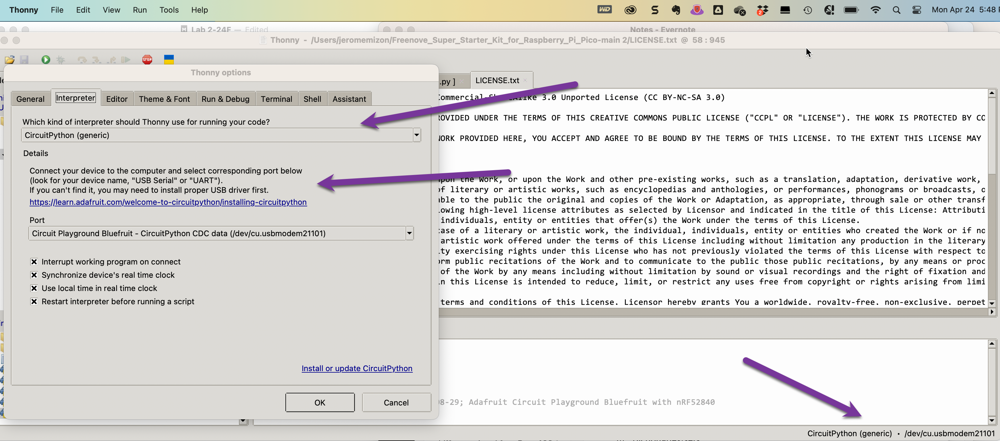
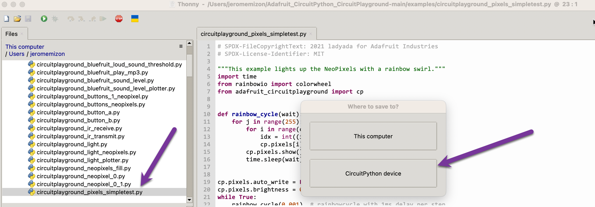
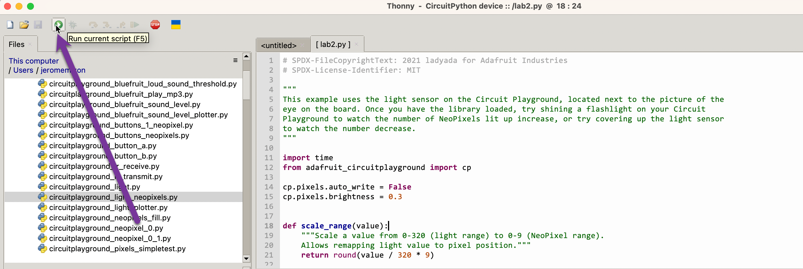

# Lab 2

The purpose of this lab is to get familiar with the debugging tools of Pycharm/Visual Studio Code and to get started with Circuit Playground Express.

### Part 1: Debugging python code

1. Download the 3 python example programs ex01.py, ex02.py, ex03.py
2. Create a new Pure Python Project in Pycharm.
3. In the location textbox, replace `PythonProject1` with `lab2` then uncheck the box "Create a main.py welcome script"
4. Use the `File|Open` menu to open the three downloaded programs.
5. Select `ex01.py` , right click and select Run to run the script. Observe the result in the Console window.
6. Repeat the same process for `ex02.py` and `ex03.py`.
7. Back on `ex01.py`, add a breakpoint line 6 of the code.
8. Click on the Debugger Tab Next to the Console Tab. Then click on the bug icon.
9. The execution of the code will stop line 6. Use the step over icon to step line by line in the code.
10. Repeat the same process on `ex02.py`. Put a breakpoint line 5.
11. Repeat the same process on `ex03.py`. Put a breakpoint line 3.
12. Learn how to stop a debugging session, view all breakpoints using the different icons.
13. Repeat the same exercises using Visual Studio Code. Note that you do not have to create a project in VS Code.

### Part 2: Thonny and Circuit Playground 

1. Download the Circuit Playground high level library from GitHub: https://github.com/adafruit/Adafruit_CircuitPython_CircuitPlayground.git

2. Unzip the file

3. Connect the Circuit Playground to your laptop.

4. Open Thonny

5. In the Run menu, click Configure Interpreter. Make sure you select Circuit Python and make sure Thonny detected your Circuit Playground (see arrows in the image below). 

6. Open the examples folder of the Circuit Playgound Library on your laptop then double click on the file `circuitplayground_pixels_simpletest.py`

7. Click File-Save As and select the `CircuitPython device` button

8. Save the file as `lab2.py`
   

9. Click on the Run script icon to run the script.
   

10. Stop the script using the STOP icon. Change the last line of the program to
    `rainbow_cycle(0.01)`

    Save the script and run it again. 
